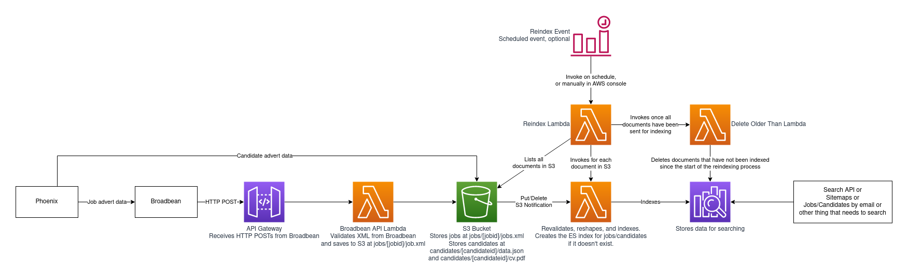

# Search Ingestion

## Receiving data

### Jobs

Receive a POST from Broadbean at `https://[hostname]/_broadbean/`, XML
is parsed and validated. If passes validation, saved to S3 bucket at
`jobs/[jobid]/job.xml`. May also receive XML that signifies to delete
a job ID, then delete from S3 bucket.

### Candidates

Files uploaded from Phoenix to `candidates/[candidateid]/data.json`
and `candidates/[candidateid]/cv.pdf`. Phoenix can also delete these
to signify removal.

## Indexing data

Files being created in S3 triggers a Lambda (one for jobs, one for
candidates) to load the file, parse and validate it, and index in
Elasticsearch. And files being deleted causes it to be deleted from
S3. The Elasticsearch domain has auto-index creation disabled, and
these indexing Lambdas handle index creation if it does not exist.

## Reindexing data

The reindex Lambda (one for jobs, one for candidates) lists all files
in S3, and triggers the index Lambda for each. Also notes the start
time of this process. Once all have been sent for indexing, invokes
another Lambda to delete any documents not indexed since the start
time. This Lambda can be run on a cron schedule.
